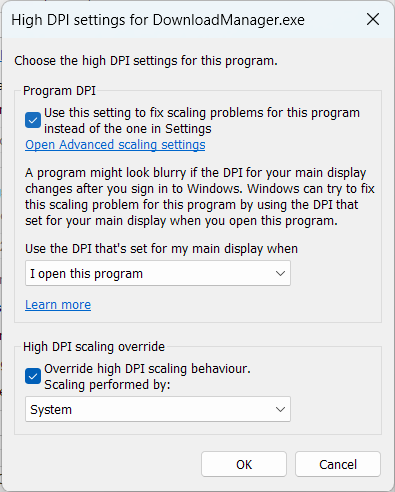

# Download Manager
   

A fast download manager for Windows to download your files.
Download Manager now contains a browser extention to help you download your files as easily as possible.
Just install the extention and download a file!
For requests for file extentions please make a [Feature Request](https://github.com/Soniczac7/Download-Manager/issues/new?assignees=&labels=enhancement&template=feature_request.md&title=).

If there are any issues with the application please make an [issue](https://github.com/Soniczac7/Download-Manager/issues/new/choose).

## Compatability
Download Manager does not currently support high DPI monitors.
If you are experiecing display issues with download manager please use the following compatability settings:

## Installation Instructions
1) Download the latest version from the [releases page](https://github.com/Soniczac7/Download-Manager/releases).
2) Extract the zip anywhere.
4) Run the executable `DownloadManagerInstaller.exe`.
5) You can also install the browser extention [here](https://microsoftedge.microsoft.com/addons/detail/download-manager/facopbimneimllhcabghncloejfeficd?hl=en-GB).

## Silent Install Exit Codes
If you choose to install the program silently using the `--install` tag please refer to the following exit codes:
 - `0` - The installation completed successfully.
 - `1` - The default drive `C:\` could not be found.
 - `2` - The installer could not install due to unauthorised access.
 - `3` - The installer could not install due to a IO error.
 - `4` - The installer could not install due to an unknown exception.

## Update Exit Codes
If you manually initiate a update to Download Manager through the command line using the `--update` tag please refer to the following exit codes:
 - `0` - The installation completed successfully.
 - `1` - Setup determined that Download Manager was already running the latest version.
 - `2` - Setup exited before the installation could complete. This could be because it was closed or cancelled by the user.
 - `3` - The update XML file is malformed.
 - `4` - The update failed due to an error during the installation process.
 - `5` - Setup could not retrieve the existing Download Manager installation. Ensure setup is in the same path as Download Manager and try again.
 
## Contribution
Any contribution will be appreciated. To contribute to this repository:
1) [Fork](https://github.com/Soniczac7/Download-Manager/fork) the repository.
2) Create a [pull request](https://github.com/Soniczac7/Download-Manager/pulls) to the `dev` branch.
3) When you are ready request `Soniczac7` as a reviewer.
4) If the pull request is ok it will be merged with the `dev` branch.
5) If there are improvements that need to be made before the branch can be merged, make them and request `Soniczac7` as a reviewer again.
Note: To build Download Manager successfully you MUST build the application in the `Debug` configuration as `Release` will not work.